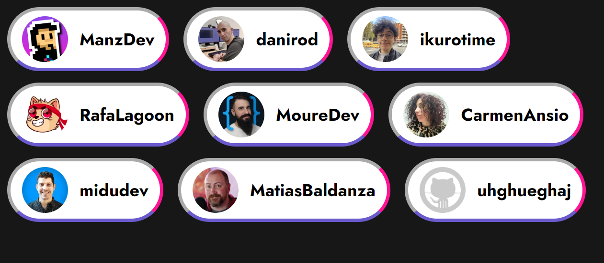
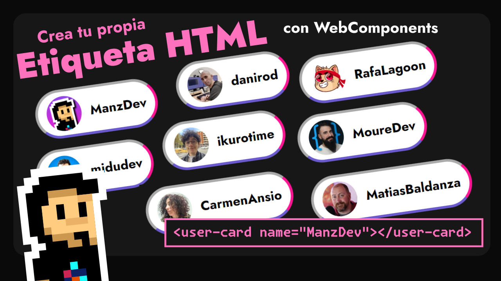

# Grid Calendar

- 📒 WebComponents: https://lenguajejs.com/webcomponents/componentes/que-son-webcomponents/
- 📒 Custom Elements: https://lenguajejs.com/webcomponents/componentes/custom-elements/
- 📒 Insertar en DOM: https://lenguajejs.com/javascript/dom/insertar-elementos-dom/
- 💾 es6-string-html (extensión vscode): https://marketplace.visualstudio.com/items?itemName=Tobermory.es6-string-html

**Previsualización**:

Video de Youtube:

- Twitch: https://twitch.tv/ManzDev
- Twitter: https://twitter.com/Manz
- Redes sociales: https://links.manz.dev/
- Página oficial: https://manz.dev/
